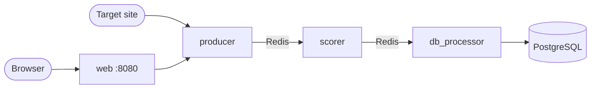

# AI-WebScraper

[](https://github.com/ZachSchwartz/AI-WebScraper/actions/workflows/ci.yml)

Give it a URL and a keyword. It fetches the page, pulls out every link with the
text around it, scores each link for how well it matches the keyword, and stores
the ranked result so you can query it later.


*118 links off one page, ranked. The gap between 86.1% and 26.1% is the
[tier boundary](#how-relevance-scoring-works): everything above it names the
keyword, everything below it is ordered on similarity alone.*

Three Flask services sit behind a queue. The producer scrapes, the scorer ranks
with a sentence transformer, and the db_processor persists. Redis carries work
between them, PostgreSQL holds the results, and the whole stack comes up with
one command.

**Stack:** Python 3.14, Flask, Redis, PostgreSQL, SQLAlchemy,
sentence-transformers (`all-MiniLM-L6-v2`), Docker Compose, gunicorn

I used a sentence transformer instead of an LLM because ranking a few hundred
links per page is an embedding-similarity problem. MiniLM answers it in
milliseconds on CPU, with no API key and no per-call cost.

The pipeline runs end to end. [Known limitations](#known-limitations) is honest
about where it stops.

## Quickstart

Needs Docker with Compose v2.

```bash
./build.sh --build      # macOS and Linux; chmod +x build.sh first
.\build.bat --build     # Windows
```

The script starts the stack, opens <http://localhost:8080>, and tears the
containers down when you press a key. `docker compose up --build` does the
same thing without the script. The first run downloads the model, so it is
slow.

See [DEVELOPMENT.md](DEVELOPMENT.md) for the API reference, configuration,
and tests.

## What it produces

```bash
curl -X POST http://localhost:8080/api/scrape \
  -H 'Content-Type: application/json' \
  -d '{"url": "https://boerneisd.net/", "keyword": "departments"}'
```

```json
{
  "source_url": "https://boerneisd.net/",
  "keyword": "departments",
  "job_id": "6f1b2c40-9a2e-4f3d-8f1a-7c5d3e9b0a11",
  "count": 118,
  "results": [
    { "url": "https://boerneisd.net/112987_1", "score": 0.921 },
    { "url": "https://boerneisd.net/424420_2", "score": 0.885 },
    { "url": "https://boerneisd.net/411504_2", "score": 0.861 },
    { "url": "https://boerneisd.net/careers", "score": 0.261 }
  ]
}
```

The jump between the third and fourth result is the tier boundary at 0.5, not a
cliff in the data: the first three name the keyword and the fourth does not.
[How relevance scoring works](#how-relevance-scoring-works) explains the split.

Two more endpoints search what has been stored: `GET /db/query` by keyword or
source page, and `GET /db/query/href` by where a link points. The page at
<http://localhost:8080> runs all three.


*`GET /db/query` reads the run back out of PostgreSQL, so the ranking survives
the request that produced it.*


*`GET /db/query/href` goes the other way, from a link to wherever it was found
and what it scored.*

## Architecture



The web service drives all three stages in order inside a single
`POST /api/scrape`, holding the browser's request open for the whole run. See
[known limitations](#known-limitations) for what that costs. The same service
proxies `GET /db/query` straight to `db_processor`.

Every scrape gets a `job_id`, and each stage reads and writes queue keys scoped
to it: `scraped_items:<job_id>` and `scraped_items_processed:<job_id>`. Two
scrapes running at once therefore cannot consume each other's links. The keys
carry an expiry that is refreshed on every push, so a job that fails partway
does not leave its items in Redis for good.

### Project layout

```
producer/     fetches a page and extracts each link with the text around it
scorer/       embeds that text and scores the link against the keyword
database/     upserts scored links into PostgreSQL and answers the queries
web_service/  the public API, the one HTML page, and the pipeline orchestration
util/         shared by the services: queue draining, URL safety, health checks
tests/        the pytest suite, which runs outside Docker
```

Each service directory holds its own `Dockerfile`, `requirements.txt`, and
`src/`. Every image is built from the repository root, so a service carries
`util/` alongside its own source rather than mounting it at run time.

## How relevance scoring works

The producer does not hand the scorer a bare URL. It joins the anchor text, the
link's attributes, the page title and description, the readable words of the URL,
the text on either side of the link, and the headings above it into one
`processed_text` that the link is scored on.

Scoring is tiered, in `scorer/src/scorer_processor.py`. Whether the keyword
appears in `processed_text` as a whole word decides which half of the range a
link lands in, and similarity orders the links inside that half:

| Tier | Range | Ordered within the tier by |
| --- | --- | --- |
| Keyword appears as a word | 0.5 to 1.0 | Equal parts whole-text similarity and the strongest context window |
| Keyword does not appear | 0.0 to 0.5 | Whole-text similarity alone |

```python
contexts = context_windows(text, keyword)
if not contexts:
    return _band(NO_MATCH_BAND, semantic_score)
return _band(MATCH_BAND, 0.5 * semantic_score + 0.5 * context_score)
```

The split is deliberate. A page that never names the keyword is usually not
about it, so the gate is the signal worth trusting most, and embedding
similarity is better at ranking near-neighbors than at deciding whether a link
belongs at all. Banding rather than weighting keeps that decision legible: the
boundary is one number to move, and each tier still spreads across its whole
range instead of collapsing onto the flat end of a curve.

Because the gate carries that much, both keyword terms read one scan of the
text. `context_windows` tokenizes on `\w+`, so punctuation does not hide an
occurrence and a keyword sitting inside a longer word does not count as one, and
the exact-match test is simply whether that scan found anything. A multi-word
keyword matches its words in sequence. Context takes the strongest window rather
than the mean, so a link that uses the keyword meaningfully once is not diluted
by the other places the page mentions it in passing.

Each cosine similarity is squashed with `_sigmoid(cos, steepness=8,
midpoint=0.3)`. The midpoint is the middle of the band MiniLM's cosines actually
occupy for a short keyword against a paragraph, so the curve spreads that band
rather than saturating above it:

| cosine(text, keyword) | no occurrence | occurrence |
| --- | --- | --- |
| 0.0 | 0.042 | 0.542 |
| 0.2 | 0.155 | 0.655 |
| 0.3 | 0.250 | 0.750 |
| 0.5 | 0.416 | 0.916 |
| 0.7 | 0.480 | 0.980 |

The right column takes the best context window as scoring like the whole text.

Embeddings are cached in memory and on a Docker volume, keyed by a hash of the
text, so a restart neither re-downloads the model nor re-encodes text it has
already seen.

## Design notes

### Fetching safety

The scraper fetches whatever URL it is handed, so
`util/url_util.assert_fetchable` resolves each host and refuses anything that is
not a public address: the Redis and Postgres containers, localhost, and the
cloud metadata endpoint are all out of reach. Redirects are checked one hop at a
time, since a public URL is free to redirect somewhere private, and `robots.txt`
is honored before any fetch. The guard is not airtight. It resolves the hostname
and `requests` then resolves it again, so a name that changes its answer between
the two lookups slips past.

### Storage

A link is identified by the keyword, the page it was found on, and where it
points, with a unique constraint on those three. Storing a link is an upsert
against that constraint rather than a read followed by a write, so two scrapes
of the same page cannot both find no existing row and both insert.

### Serving

Each service runs under gunicorn rather than the Flask development server, with
a worker count and timeout set per service. The scorer runs a single worker,
because a second would hold its own copy of the transformer and contend for the
same cores. Timeouts sit well above gunicorn's 30 second default, since these
requests drain a queue rather than answer from memory.

### Front end

The one page the stack serves has no build step, and its Bootstrap stylesheet is
vendored rather than pulled from a CDN. Every result on it came from a scraped
third-party document, so it is written into the DOM as text rather than
interpolated into markup, and a link is only clickable if it is `http` or
`https`.

## Known limitations

These are worth knowing before reading the code. Each one notes the shortest
path to a fix.

**The tier boundary is unforgiving, and none of it is calibrated.** The gate
matches whole words only, so `harnesses` does not count as `harness` and a page
that consistently uses the plural drops a whole tier. Stemming the keyword and
the text together would close that. The two constants that shape everything
else, the 0.5 boundary and the 0.3 cosine midpoint, were picked from the shape
of the cosine distribution rather than from a labeled set, so the ordering is
reasonable but the numbers are not evidence.

**The pipeline is orchestrated synchronously.** `web_service` calls the three
services in sequence and holds the HTTP request open for the whole run
(`PIPELINE_TIMEOUT`, 180s), so the Redis queues decouple the services but not
the request. The fix is a job-status endpoint that returns the `job_id`
immediately and lets the page poll while workers drain the queues.

**One page per scrape.** `scrape()` reads `targets[0]` and ignores the rest, and
it does not follow the links it finds. There is no crawl depth and no per-domain
rate limiting beyond `robots.txt`.

**There are no migrations.** `ensure_schema` builds the schema from the models
at startup, but `create_all` skips a table that already exists, so changing a
column still means recreating the volume. Alembic would close that.

**No authentication or rate limiting.** Every endpoint is open to anyone who can
reach the port. That is fine for a local stack and not fine for a deployed one.

## License

Released under the [MIT License](LICENSE).
