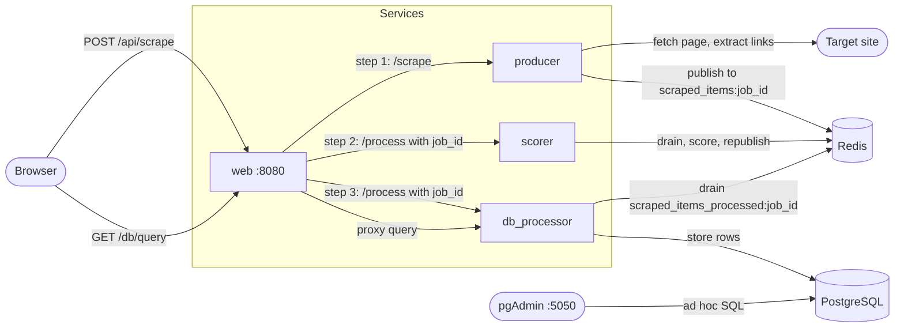

# AI-WebScraper

[](https://github.com/ZachSchwartz/AI-WebScraper/actions/workflows/ci.yml)

## Introduction

This project is designed to allow for web scraping, finding links, and relevance scoring using a combination of Redis, PostgreSQL, and a sentence transformer model. It provides an API that allows users to scrape web pages, analyze extracted links, and query stored data based on relevance to a given keyword. It does all this through an easy to use and understand locally hosted page, that gets run with the program.

The system consists of three main components:

- **Producer**: Extracts links and surrounding HTML from the target URL and loads them into a Redis queue.
- **Scorer**: Uses a sentence transformer model to generate relevance scores by analyzing semantic similarity and keyword context.
- **Consumer**: Stores the processed data, including URLs, keywords, relevance scores, and metadata, in a PostgreSQL database.

The application supports three primary API endpoints:  
- **Scrape**: Retrieves and processes links from a given URL.  
- **Query**: Searches stored data for links related to a keyword or source URL.  
- **Href Query**: Fetches links that were found embedded within other webpages.

This README provides setup instructions, API details, and information on how relevance scoring is performed.

## Architecture



The web service holds the browser's request open while it drives all three steps in
order; the numbered calls above happen one after another within a single
`POST /api/scrape`. See [Known Limitations](#known-limitations) for what that costs.

Every scrape gets a `job_id`, and each stage reads and writes queue keys scoped to
it — `scraped_items:<job_id>` and `scraped_items_processed:<job_id>`. Two scrapes
running at once therefore cannot consume each other's links. The keys carry an
expiry, refreshed on every push, so a job that fails partway does not leave its
items in Redis for good.


## Setup Instructions

### First-Time Setup:
Clone the Repository off Github

Run to initialize the application and set up the necessary components. Running this with or without the --build flag will open a local host webpage. First time setup will be slow since it will have to install dependencies.

Windows:

```.\build.bat --build```

Mac (first make the script executable with `chmod +x build.sh`):

```./build.sh --build```


Subsequent Runs:
Run to start the application. Each service image carries its own source, so pass
`--build` after changing any code.

Windows:

```.\build.bat```

Mac:

```./build.sh```


Database Deletion:
To delete the database

Windows:

```.\build.bat --delete_db```

Mac:

```./build.sh --delete_db```


### Upgrading an existing database:
The schema is created from the models if the table is not already there, which means an existing volume keeps whatever it was built with. A database created before the unique constraint on `(keyword, source_url, href_url)` will not gain it; run `--delete_db` once to rebuild.

### Configuration:
The stack runs out of the box on local development defaults. To change the database or pgAdmin credentials, copy `.env.example` to `.env` and edit it; Docker Compose picks it up automatically. `.env` is gitignored, so your values stay local.


## Running the Tests
The test suite runs outside Docker and needs no model download. Every check below also runs in CI on each push, alongside a build of the service images.

```
pip install -r requirements-dev.txt
pytest
black --check database scorer producer util web_service tests
pylint --disable=import-error database scorer producer util web_service tests
mypy --ignore-missing-imports database scorer producer util web_service
```

`pytest` reports coverage and fails below 80%; the thresholds live in `pytest.ini`. The database tests run against SQLite, so the upsert that stores a link is built for whichever dialect the engine speaks. The annotations are checked rather than decorative, so `mypy` gates a merge alongside the tests. Redis is stubbed in process with `fakeredis` and the database tests run against SQLite, so no service needs to be up.

The scorer service imports `torch` and `sentence-transformers` at module level, which together weigh over a gigabyte. Rather than install them to test scoring, `tests/conftest.py` substitutes a deterministic stand-in that embeds text as a hashed bag of words, so cosine similarity still rises with shared vocabulary and the scoring logic is exercised in full.


## Serving
Each service is served by gunicorn rather than the Flask development server that `app.run()` starts, and each image's `CMD` sets a worker count and timeout for what that service actually does: the scorer runs a single worker because a second would hold its own copy of the transformer and contend for the same cores, and every timeout is well above gunicorn's 30 second default because these requests drain a queue rather than answer from memory. The web service's is the longest, since it holds one request open across all three pipeline steps.


## Storage
A link is identified by the keyword, the page it was found on, and where it points, and a unique constraint on those three is what keeps a rescrape to one row. Storing a link is an upsert against that constraint rather than a read followed by a write, so two scrapes of the same page running at once cannot both find no existing row and both insert.


## Fetching Safety
The scraper fetches whatever URL it is handed, which would otherwise make it a way to reach the private network the services run on. `util/url_util.assert_fetchable` resolves each host and refuses anything that is not a public address, so the Redis and Postgres containers, localhost, and the cloud metadata endpoint are all out of reach. Redirects are followed one hop at a time and checked the same way, since a public URL is free to redirect somewhere private. `robots.txt` is honoured before any page is fetched.


## API Overview
The application supports three primary API calls:

### Scrape:
- Endpoint: http://producer:5000/scrape

- Arguments:

  - keyword: The search term.

  - url: The URL to scrape.

- Process:

1. The producer retrieves the target URL, extracts all links, and gathers the surrounding HTML data for each link, then is loaded into a Redis queue.

2. The scorer module processes the queue, generating a relevance score for how closely each link relates to the keyword, then loads it back into the Redis queue.

3. The consumer stores the URLs, keyword, scores, and additional metadata in a PostgreSQL database.

### Query:
- Arguments:

  - keyword: (Optional) The search term.

  - source_url: (Optional) The URL to query.

- Process:

1. Searches the database for previously stored data matching the keyword, source URL, or both.

2. Returns all related links, sorted by relevance score.

### Href Query:
- Arguments:
  - href_url: a URL found on a previously searched web page.
- Process:

1. Queries the database for links found on webpages (rather than source URLs).

2. Useful for retrieving embedded or referenced links.

## Link Prioritization
For the link prioritization task, a sentence transformer was employed to avoid the overhead of a full LLM. After extracting relevant HTML content and metadata, the data is split into strings and stored in a list. The sentence transformer generates embeddings for both the context and the keyword. Using these embeddings, the scorer_processor calculates a relevance score by combining semantic similarity with custom weights.

### The scoring process involves:
1. Exact Match Bonus: A high weight is assigned if the keyword appears in the text.

2. Semantic Similarity: Embeddings for the text and keyword are compared using cosine similarity to measure their semantic relationship.

3. Context Analysis: When an exact match is found, the words around each standalone occurrence are checked to ensure the keyword is used meaningfully. The strongest of those windows is the one that counts, so a link that uses the keyword well once is not diluted by the places the same page repeats it bare.

4. Weighted Combination: The final score is computed by combining the exact match, semantic similarity, and context scores with weights 0.5, 0.3, and 0.2.

5. Normalization: A sigmoid function is applied to the score to ensure it falls within the 0-1 range and to emphasize differences between scores.


## Database Access
If you wish to access the database to perform your own queries, or check out the raw data stored alongside a link, here are the instructions
1. Perform the setup instructions
2. Go to localhost:5050
3. Sign in with the pgAdmin credentials from your `.env` (defaults: admin@example.com / admin)
4. Open scraper > databases > scraper > schemas > public > tables > scraped_items
5. Right click on scraped_items, and select "Query Tool"
6. You can now run any psql command you'd like on the database


## Known Limitations

Worth knowing before reading the code, and the shortest path to fixing each.

**The pipeline is orchestrated synchronously.** `web_service` calls the producer, then the scorer, then the database service in sequence, holding the HTTP request open for the whole run (`PIPELINE_TIMEOUT`, 180s by default). The Redis queues decouple the *services* but not the *request*, so the queue does less work than the architecture suggests. The fix is a job-status endpoint: `/api/scrape` returns its `job_id` immediately, workers drain the queues on their own schedule, and the page polls for results. Celery or RQ would cover it.

**One page per scrape.** `scrape()` reads `targets[0]` and ignores the rest of the list, and it does not follow the links it finds. There is no crawl depth and no per-domain rate limiting beyond `robots.txt`.

**There are no migrations.** The models are now the only definition of the schema and `ensure_schema` creates it at startup, so there is no hand-written DDL left to drift from them. That is not the same as a migration: `create_all` skips a table that already exists, so changing a column still means recreating the volume with `--delete_db`. Alembic would make a schema change deployable without that.

**`assert_fetchable` cannot survive DNS rebinding.** The guard resolves a hostname, then hands the URL to `requests`, which resolves it again. A name that changes its answer between those two lookups slips past. Closing it properly means pinning the validated address into the connection rather than re-resolving.

**Scoring batches within a link, not across them.** `_get_embeddings` sends every text one score needs to the model in a single call, but each link is still scored on its own. Batching a whole page into one `encode` would mean a queue contract that hands the processor a batch rather than an item, which all three services share.

**No authentication or rate limiting.** Every endpoint is open to anyone who can reach the port. That is fine for a local stack and not fine for a deployed one.


## License
Released under the [MIT License](LICENSE).
