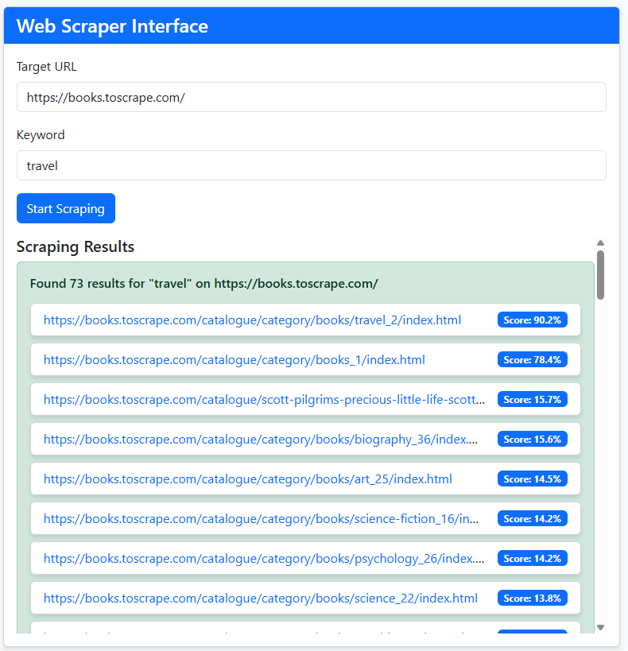
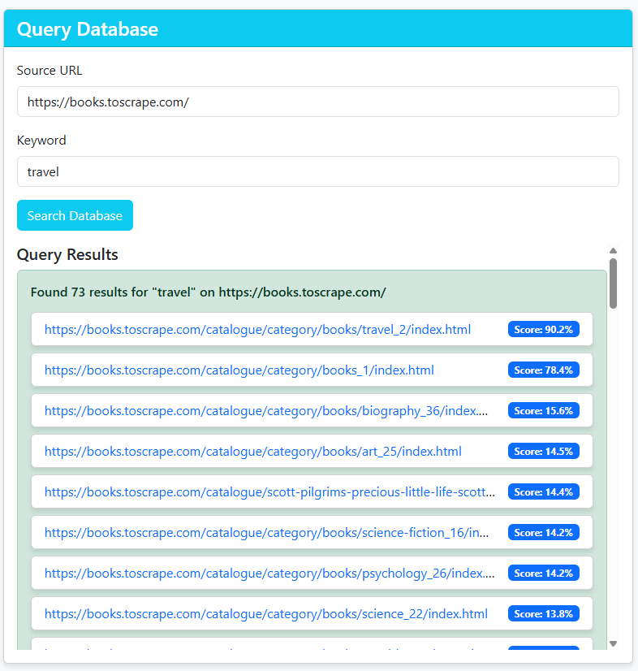
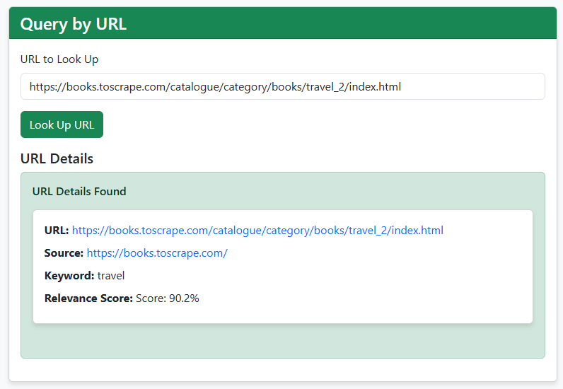

# AI-WebScraper

[](https://github.com/ZachSchwartz/AI-WebScraper/actions/workflows/ci.yml)

Given a URL and a keyword, the application fetches the page, pulls out every link with the
text around it, scores each link for how well it matches the keyword, then stores
the ranked result so you can query it later.



*118 links off one page, ranked. The gap between 86.1% and 26.1% is
[the split at 50%](#how-relevance-scoring-works): every link above it contains
the keyword, every link below it does not.*

Three Flask services sit behind a queue. The producer scrapes, the scorer ranks
with a sentence transformer, and the db_processor persists. Redis carries work
between them, PostgreSQL holds the results, and the whole stack comes up with
one command.

**Stack:** Python 3.14, Flask, Redis, PostgreSQL, SQLAlchemy,
sentence-transformers (`all-MiniLM-L6-v2`), Docker Compose, gunicorn

I used a sentence transformer instead of an LLM because ranking a few hundred
links per page is an embedding-similarity problem. MiniLM answers it in
milliseconds on CPU, with no API key and no per-call cost.

See [DEVELOPMENT.md](DEVELOPMENT.md) for the API reference, configuration,
and tests.

## Quickstart

Needs Docker with Compose v2.

```bash
./build.sh --build      # macOS and Linux; chmod +x build.sh first
.\build.bat --build     # Windows
```

The script starts the stack, opens <http://localhost:8080>, and tears the
containers down when you press a key. The first run downloads the model, so it is quite
slow.

## What it produces

```bash
curl -X POST http://localhost:8080/api/scrape \
  -H 'Content-Type: application/json' \
  -d '{"url": "https://boerneisd.net/", "keyword": "departments"}'
```

```json
{
  "source_url": "https://boerneisd.net/",
  "keyword": "departments",
  "job_id": "6f1b2c40-9a2e-4f3d-8f1a-7c5d3e9b0a11",
  "count": 118,
  "results": [
    { "url": "https://boerneisd.net/112987_1", "score": 0.921 },
    { "url": "https://boerneisd.net/424420_2", "score": 0.885 },
    { "url": "https://boerneisd.net/411504_2", "score": 0.861 },
    { "url": "https://boerneisd.net/careers", "score": 0.261 }
  ]
}
```

The jump between the third and fourth result is the split at 0.5, not a cliff in
the data: the first three contain the keyword and the fourth does not.
[How relevance scoring works](#how-relevance-scoring-works) explains why.

Two more endpoints search what has been stored: `GET /db/query` by keyword or
source page, and `GET /db/query/href` by where a link points. The page at
<http://localhost:8080> runs all three.



*`GET /db/query` reads the run back out of PostgreSQL, so the ranking survives
the request that produced it.*



*`GET /db/query/href` goes the other way, from a link to wherever it was found
and what it scored.*

## Architecture


The web service drives all three stages in order inside a single
`POST /api/scrape`, holding the browser's request open for the whole run. The same service
proxies `GET /db/query` straight to `db_processor`.

Every scrape gets a `job_id`, and each stage reads and writes queue keys scoped
to it: `scraped_items:<job_id>` and `scraped_items_processed:<job_id>`. The keys
carry an expiry that is refreshed on every push, so a job that fails partway
does not leave its items in Redis for good.

### Project layout

```
producer/     fetches a page and extracts each link with the text around it
scorer/       embeds that text and scores the link against the keyword
database/     upserts scored links into PostgreSQL and answers the queries
web_service/  the public API, the one HTML page, and the pipeline orchestration
util/         shared by the services: queue draining, URL safety, health checks
tests/        the pytest suite, which runs outside Docker
```

Each service directory holds its own `Dockerfile`, `requirements.txt`, and
`src/`. Every image is built from the repository root, so a service carries
`util/` alongside its own source rather than mounting it at run time.

## How relevance scoring works

The producer does not hand the scorer a bare URL. It joins the anchor text, the
link's attributes, the page title and description, the readable words of the URL,
the text on either side of the link, and the headings above it into one
`processed_text` that the link is scored on.

The score has two halves, and one question decides which half a link lands in:
does the keyword appear in `processed_text` as a whole word?

- **Yes** — the link scores between 0.5 and 1.0.
- **No** — the link scores between 0.0 and 0.5.

So a link that contains the keyword always outranks one that does not, however
similar the second one looks. A page that never says the word is usually not
about it, embeddings are good at
ranking pages that are already close to each other, and much weaker at deciding
whether a page belongs at all.

Similarity then orders the links inside each half, in
`scorer/src/scorer_processor.py`:

```python
contexts = context_windows(text, keyword)
if not contexts:
    return _band(NO_MATCH_BAND, semantic_score)
return _band(MATCH_BAND, 0.5 * semantic_score + 0.5 * context_score)
```

A link with no occurrence of the keyword is ranked on how close its whole text
is to the keyword, and nothing else. A link that does contain the keyword is
ranked on that, averaged with its best occurrence: the seven words around each
place the keyword appears are scored on their own, and only the strongest one
counts, so a link that uses the keyword meaningfully once is not dragged down by
the other places the page mentions it in passing.

One scan of the text answers both questions, where the keyword is and therefore
whether it is there at all, so the two cannot disagree. It splits on `\w+`, which
means punctuation does not hide an occurrence, `cat` does not count as an
occurrence of `concatenate`, and a keyword of several words has to appear as
those words in order.

Closeness is cosine similarity between two embeddings. For a one-word keyword
against a paragraph that lands in a narrow band near 0.3 rather than spreading
across 0 to 1, so `_sigmoid(cos, steepness=8, midpoint=0.3)` stretches the band
back out, centered on 0.3 so a typical similarity comes out mid-scale:

| cosine similarity | keyword absent | keyword present |
| --- | --- | --- |
| 0.0 | 0.042 | 0.542 |
| 0.2 | 0.155 | 0.655 |
| 0.3 | 0.250 | 0.750 |
| 0.5 | 0.416 | 0.916 |
| 0.7 | 0.480 | 0.980 |

The right column takes the best occurrence as scoring like the whole text.

Embeddings are cached in memory and on a Docker volume, keyed by a hash of the
text, so a restart neither re-downloads the model nor re-encodes text it has
already seen.

## Design notes

### Fetching safety

The scraper fetches whatever URL it is handed, from inside a private network
where `http://redis:6379`, `localhost`, and a cloud metadata endpoint are all
reachable. That is server-side request forgery: the caller cannot reach those
addresses, but this service can.

`util/url_util.assert_fetchable` resolves the host first and refuses any address
Python does not consider global, covering loopback, private ranges, and
link-local in one test rather than a blocklist. A public URL can still redirect
somewhere private, so the producer follows redirects itself and checks each hop.
`robots.txt` is honored before any fetch, which is courtesy rather than defense.

It isn't airtight, `requests` resolves the name a second time when it connects,
so a host that changes its answer between the two lookups gets through.

### Storage

Two scrapes of one page for one keyword should leave one row. Checking whether
that row exists and then inserting leaves a window: both scrapes look, both see
nothing, both insert.

A link is identified by its keyword, source page, and destination, and a unique
constraint on those three moves that identity into the database. One upsert
settles the collision inside a single statement, with no window to interleave. A
page can link to the same place twice, so within a scrape the strongest score
wins, matching what the API returns; a later scrape replaces the row outright.

### Serving

Each service runs under gunicorn with its own worker count and timeout, set well
above the 30 second default that would otherwise kill a worker mid-scrape. The
scorer runs a single worker, each is a separate process holding its own copy of
the model, so a second would double the memory and then contend for the same
cores.

### Front end

Every URL and every word on the results page came out of a third-party document,
so anchor text reading `<script>...</script>` would run in the user's browser and
an `href` of `javascript:...` would run on click.

Results are written with `textContent`, which sets text and never markup;
`innerHTML` appears nowhere in the file. A result is clickable only when its
scheme is `http` or `https`. Bootstrap is vendored rather than pulled from a
CDN, and the page has no build step.

## Known limitations

These are worth knowing before reading the code. Each one notes the shortest
path to a fix.

**The keyword test is unforgiving, and none of it is calibrated.** It matches
whole words only, so `harnesses` does not count as `harness` and a page that
consistently uses the plural drops into the lower half. Stemming the keyword and
the text together would close that. The two constants that shape everything
else, the 0.5 split and the 0.3 the similarity curve is centered on, were picked
from the shape of the similarity distribution rather than from a labeled set, so
the ordering is reasonable but the numbers are not evidence.

**The pipeline is orchestrated synchronously.** `web_service` calls the three
services in sequence and holds the HTTP request open for the whole run
(`PIPELINE_TIMEOUT`, 180s), so the Redis queues decouple the services but not
the request. The fix is a job-status endpoint that returns the `job_id`
immediately and lets the page poll while workers drain the queues.

**One page per scrape.** `scrape()` reads `targets[0]` and ignores the rest, and
it does not follow the links it finds. There is no crawl depth and no per-domain
rate limiting beyond `robots.txt`.

**There are no migrations.** `ensure_schema` builds the schema from the models
at startup, but `create_all` skips a table that already exists, so changing a
column still means recreating the volume. Alembic would close that.

**No authentication or rate limiting.** Every endpoint is open to anyone who can
reach the port. That is fine for a local stack and not fine for a deployed one.

## License

Released under the [MIT License](LICENSE).
